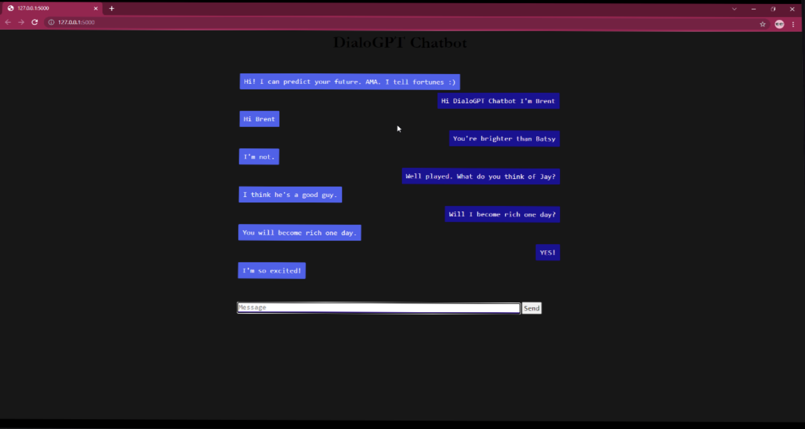

# Virtual-chatbot using NLP

To build a fortune-telling chatbot.  

The project is aimed at filling the demand for people who want their futures predicted. 

When the superintelligent AI is finally ready for transfer learning, their product will be there.

## Step by Step NLP: Data to Deployment
[A workshop on how to build and deploy a virtual chatbot using Natural Language Processing](https://www.eventbrite.com/e/step-by-step-natural-language-processing-workshop-from-data-to-deployment-tickets-201001560077) helped to deploy the [DialoGPT-medium](https://huggingface.co/microsoft/DialoGPT-medium) chatbot to your local machine or to the cloud

### Here's how it looks:

## License
This source is free to use, but ChatterBot does have a license which still applies and can be found on the 
[LICENSE](https://github.com/gunthercox/ChatterBot/blob/master/LICENSE) page.
